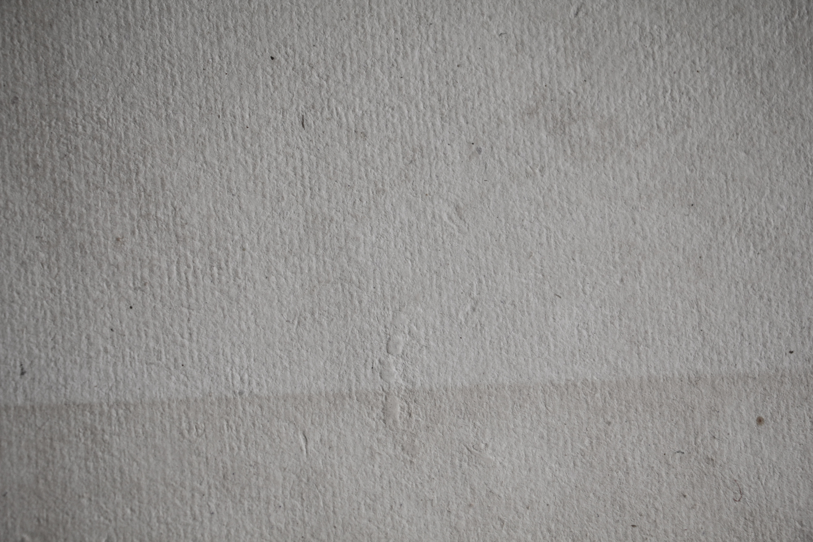

Problem Statement – Imaging Science

The task is to fix uneven lighting in an image (like paper or fabric) and recover the true texture of the surface.
We model the image as:

I(x, y) = R(x, y) × L(x, y)
where R(x, y) is the texture and L(x, y) is the illumination.

The goal is to separate these components in the log domain, manually extract high (texture) and low (lighting) frequencies, and reconstruct the reflectance image.
The method also works for color images, correcting illumination while preserving natural colors.

Reference :- To solve the problem of uneven lighting in images, where some regions appear brighter or darker due to non-uniform illumination, the approach refers to the paper “Uneven illumination correction of digital images: A survey of the state of the art” by Nilanjan Dey, Department of Information Technology, Techno India College of Technology, West Bengal, India.

To solve this problem, the Retinex model (I = R × L) described in the paper is used, which separates the image into reflectance (true texture) and illumination (lighting).

The image is converted into the log domain to make the separation easier, as suggested in the paper (log(I) = log(R) + log(L)).
Then, a Gaussian low-pass filter is manually created to estimate the smooth illumination component (L), following the paper’s homomorphic filtering and low-pass filtering approach.
By subtracting this illumination from the log image, the reflectance the real texture under uniform light is extracted.

Finally, for color images, this process is applied to each RGB channel and joint normalization is performed to preserve true color ratios, reflecting the paper’s discussion on color constancy and illumination normalization.

# Imaging_Science Project

---

##  Getting Started

##### Follow these steps to clone the repository, set up the environment, and run the project.

---

### 1. Clone the Repository

##### Open your terminal or command prompt and run the following command to clone this repository to your local machine:

git clone https://github.com/Savale-pandurang/Imaging_Science.git

### 2. Navigate to the Project Directory

##### Change your current directory to the newly cloned project folder:

cd Imaging_Science

### 3. Install Required Dependencies

##### Once your virtual environment is activated, install all the necessary packages listed in the requirements.txt file:

pip install -r requirements.txt

### 4. Run the Project.

##### Finally, run the main script to start the project:

python main.py
